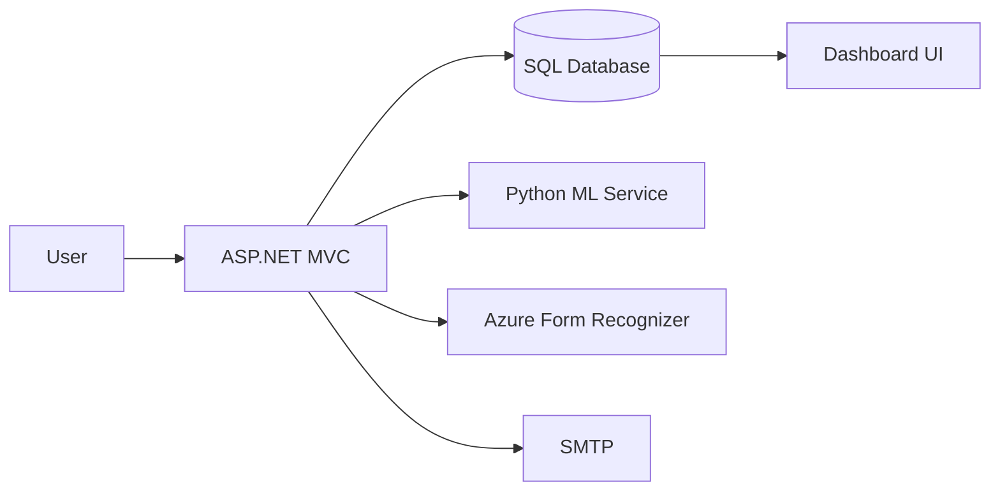

# Slide 1: Title

**ProactED**
Predictive Asset Management & Maintenance Platform  
_Nabila, [Member 2], [Member 3]_

---

# Slide 2: Agenda

1. Project Objectives  
2. Key Features  
3. Proposed Solution  
4. Methodology & Workflow  
5. Tools & Technologies  
6. Expected Outcomes  
7. SDG Alignment (4 & 12)  
8. Demo Preview

---

# Slide 3: Project Objectives

- Minimize unplanned equipment downtime  
- Optimize inventory levels and reorder alerts  
- Automate usage tracking from academic timetables  
- Deliver intuitive dashboards to stakeholders

---

# Slide 4: Key Features

- **Predictive Maintenance**: ML-driven failure predictions  
- **Inventory Management**: Real-time stock + alerts  
- **Timetable Integration**: PDF parsing for usage analytics  
- **Notifications**: Email & in-app alerts  
- **Reporting & Export**: CSV, logs, and testing scripts

---

# Slide 5: Proposed Solution

- **Backend**: ASP.NET Core MVC (C#)  
- **Frontend**: Razor views + Bootstrap 5  
- **Data**: Entity Framework Core + SQL Server  
- **ML Service**: Python (scikit-learn) via API  
- **PDF Parsing**: Azure Form Recognizer

---

# Slide 6: Methodology & Workflow

1. Requirement Gathering  
2. Architecture Design (MVC + Services)  
3. Iterative Implementation & Testing  
4. Integration of ML API & Form Recognizer  
5. Deployment on Azure

---

# Slide 7: Tools & Technologies

- **Frameworks**: .NET 7, EF Core, Bootstrap 5  
- **Languages**: C#, Python  
- **Cloud**: Azure Form Recognizer, Azure SQL  
- **DevOps**: GitHub Actions, xUnit, Postman  

---

# Slide 8: Expected Outcomes

- 20% reduction in downtime  
- 30% inventory carrying cost savings  
- 90% automated usage tracking  
- Enhanced stakeholder decision-making

---

# Slide 9: SDG Alignment

**SDG 4 (Quality Education)**  
- Data-driven lab scheduling insights  
- Efficient allocation of academic resources  

**SDG 12 (Responsible Consumption & Production)**  
- Inventory optimization to minimize waste  
- Prolonged equipment lifespan via predictive maintenance

---

# Slide 10: Demo Preview

- Upload timetable PDF  
- View usage & maintenance predictions  
- Add stock + trigger alerts  
- Explore ML dashboard & export reports

---

# Slide 11: Thank You

Questions?
